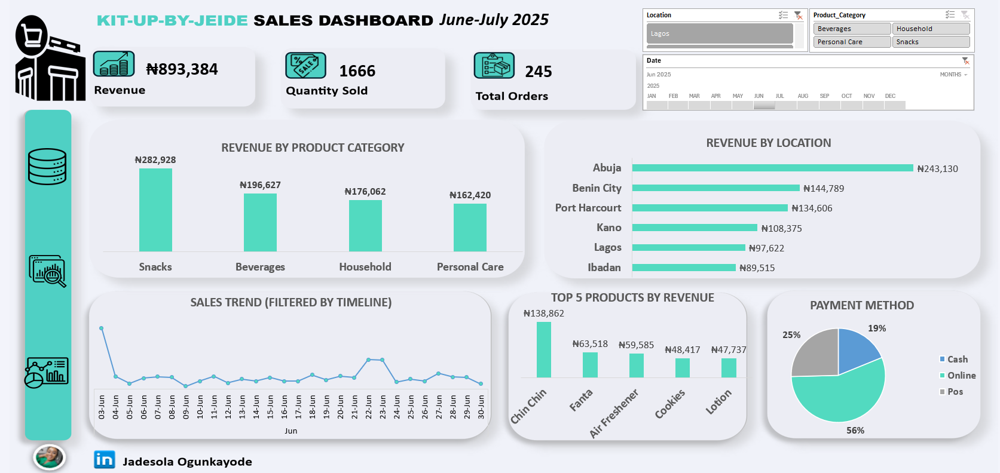

# 📊 Retail Sales Performance Dashboard in Excel

## 🏢 Business Problem

Kit-Up-By-Jeide needed better visibility into sales performance across product categories, locations, and payment methods.

The goal of this dashboard was to help track revenue trends, monitor customer purchasing behaviour, identify top-performing products, and support data-driven business decisions.

## 🎯 Project Goal

The aim of this project was to build an interactive Excel dashboard capable of tracking key sales KPIs and uncovering insights related to:
- Revenue performance
- Product category sales
- Sales trends
- Location performance
- Payment methods
- Product performance
- 
## 📁 Dataset Information

The dataset contains retail sales transaction records between June and July 2025.

It consists of:
- 250 records
- 11 columns

### Key Fields Included:
- Product Category
- Product Name
- Revenue
- Quantity Sold
- Order Date
- Location
- Payment Method

## 🧹 My Process

### 1. Data Cleaning
- Removed inconsistencies
- Checked missing values
- Standardized categories

### 2. Data Analysis
- Created pivot tables
- Performed KPI calculations
- Analysed revenue trends

### 3. Dashboard Development
- Designed interactive Excel dashboard
- Added slicers and timeline filters
- Created KPI cards and visualizations

## 🛠️ Tools Used
- Microsoft Excel
- Pivot Tables
- Pivot Charts
- Slicers
- Timeline Filters
- Data Cleaning

## 📊 Dashboard Features
- Revenue Analysis
- Quantity Sold Tracking
- Total Orders Monitoring
- Revenue by Product Category
- Revenue by Location
- Sales Trend Analysis
- Payment Method Analysis
- Interactive Filtering

## 🔍 Key Insights
- Abuja generated the highest revenue.
- Snacks category generated the highest sales revenue.
- Chin Chin was the top-performing product.
- Online payment method accounted for the majority of transactions.

## 💡 Recommendations

- Increase focus on high-performing product categories such as Snacks.
- Expand sales efforts in Abuja due to strong revenue performance.
- Promote online payments since they dominate customer transactions.
- Investigate low-performing products for possible improvement or replacement.

## 🧠 Skills Demonstrated
- Data Visualization
- Dashboard Design
- Excel Analytics
- Business Intelligence Reporting
- Data Cleaning

## 📂 Repository Structure

- Dashboard Excel File
- Dataset
- Dashboard Screenshot
- README Documentation
  
## 🖼️ Dashboard Preview

## ✅ Final Conclusion

This project demonstrates how Microsoft Excel can be used as a business intelligence and data visualization tool to analyse retail sales performance.

Through data cleaning, analysis, and dashboard development, meaningful insights were uncovered to support better business decision-making and sales strategy.
